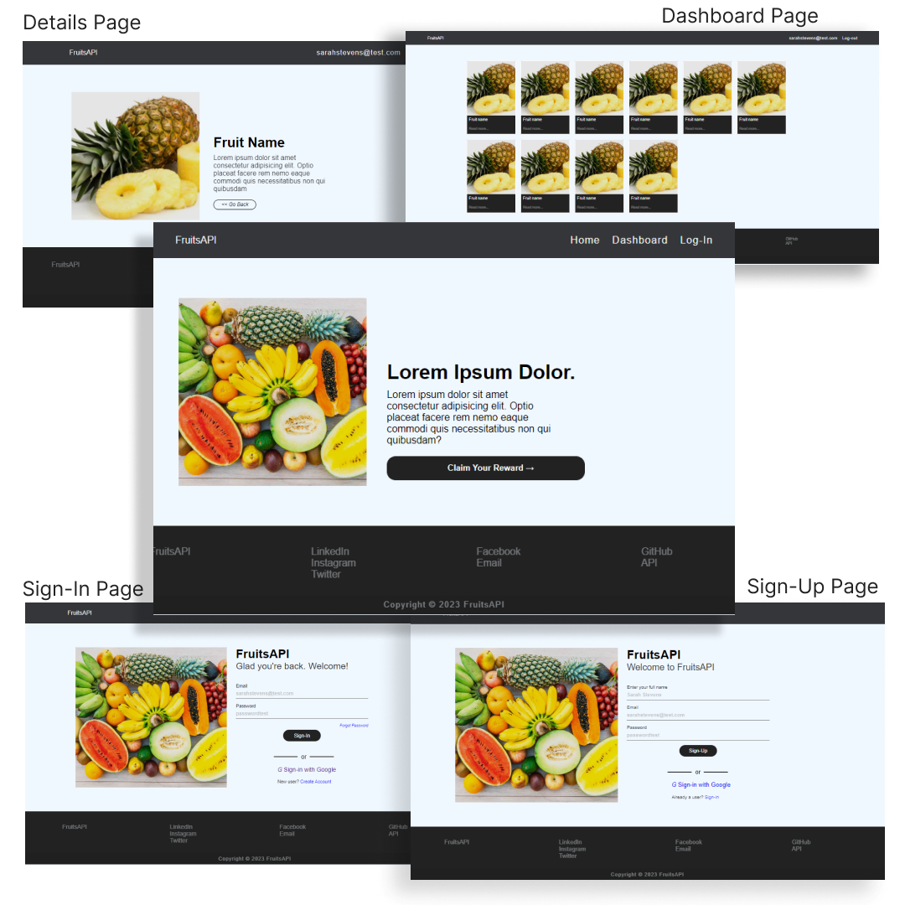

 PROJECT NAME  : <b>```project4-fruitsAPI-ui```</b>

##### (<i>a fake Fruit API </i>)

<h5>
    <details>
        <summary>TOOLS</summary>
        HTML | CSS
    </details>
</h5> <br><hr><br><br>

## DESCRIPTION

In this fourth section of the series of me learning<br> to create API I renamed project from [<b>x-api</b>](https://github.com/apOGBA424/APIs/tree/main/x-api 'Click to visit " x-api " github repository') to [<b>fruitsAPI</b>](https://github.com/apOGBA424/APIs/tree/main/project4-fruitsAPI-ui).<br> Also, I designed few dummy pages with HTML & CSS using some static online<br> based images and Lorem-Ipsum texts which i<br> re-used across each pages respectively.<br>However, note that the pages were not designed to<br> be responsive, thus will appear broken on mobile<br> phone browser and other screen browsers less than<br> 1000px in width.<br><br>

### FEATURES
A simple five pages website as show in image below written in HTML and CSS.<br><br>


<br><br>
