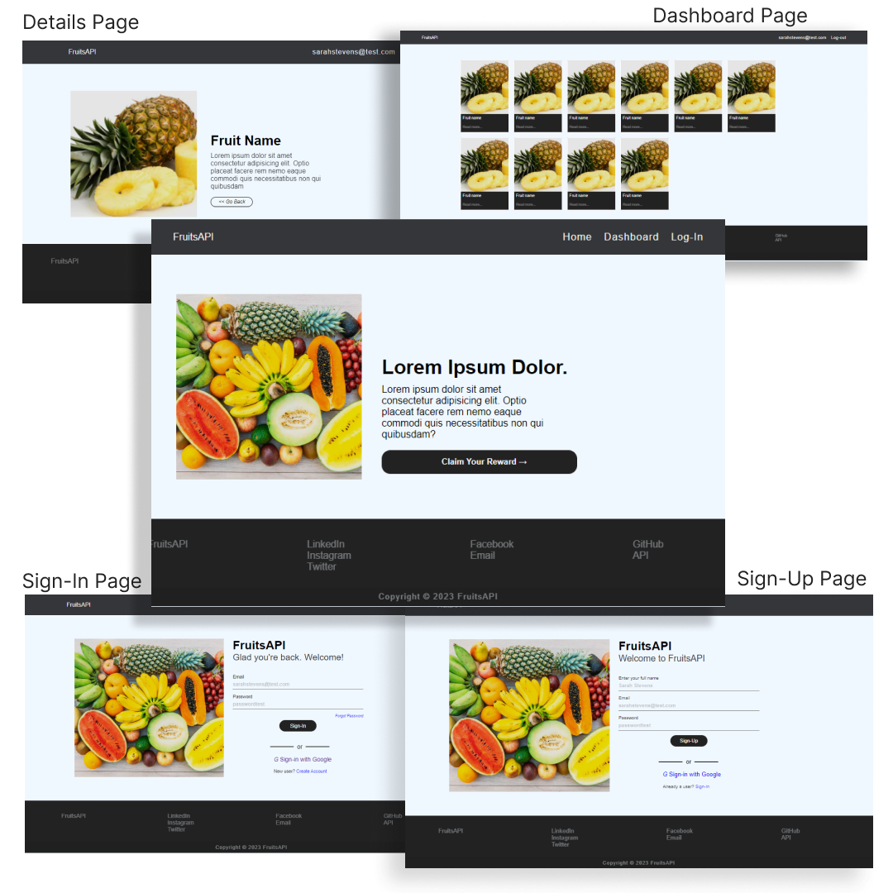

 PROJECT NAME  : <b>```project5-fruitsAPI-ui-ejs```</b>

##### (<i>a fake Fruit API </i>)

<h5>
    <details>
        <summary>TOOLS</summary>
        HTML | CSS | EJs
    </details>
</h5> <br><hr><br><br>

## DESCRIPTION

This fifth section is a continuation from the [<b>fourth</b>](https://github.com/apOGBA424/APIs/tree/main/project4-fruitsAPI-ui) project.<br> Here I initialized **node** then, installed and import [<b>EJs</b>](https://www.npmjs.com/package/ejs), a **NodeJs**<br> dependency for injecting dynamic data to an html tag.<br>

However, note that the pages were not designed to be<br> responsive, thus will appear broken on mobile phone browser and<br> other screen browsers less than 1000px in width.<br><br>

### FEATURES
A simple five pages website as show in image<br> below written in HTML, CSS and EJs.<br><br>


<br><br>
